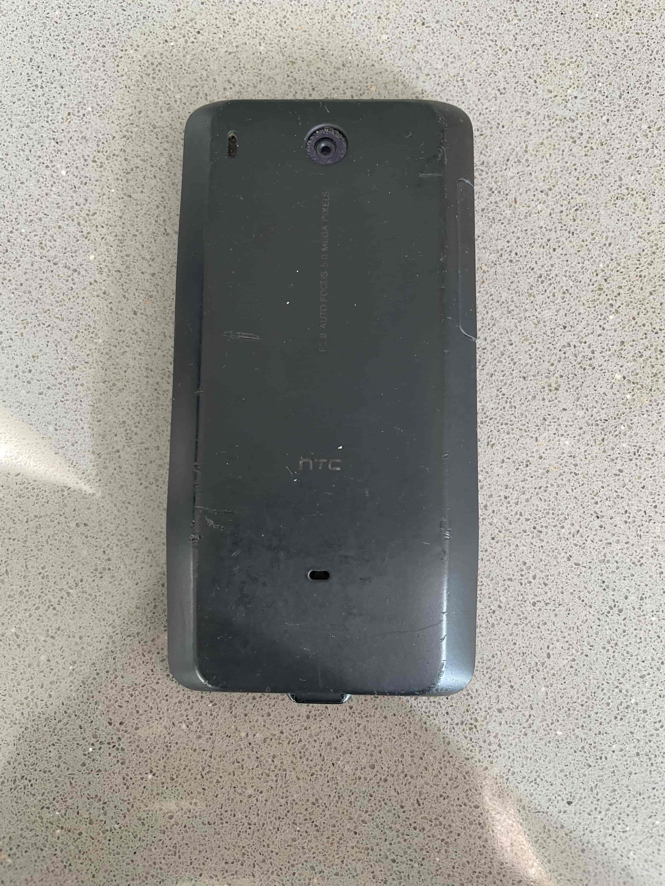

This was my first smartphone. The [HTC Hero, aka chin](https://www.mobilephonemuseum.com/phone-detail/htc-hero).

It was so useful had a right size of form factor but was also quite quirky. I mean it had a chin hence why it was called, rather unimaginatively, the chin. That would always get a conversation started when I pulled it out to do something.

> Look at that chin!

I used to pay £28 a month for data and the phone, which was extortionate at the time but it was the start of paying for my own things and I was naive to how much things costed.

I really enjoyed the physical back button, the mouse track pad less so, but the camera and the first apps were just great.

The chin was reliable, but using it felt like it got slower and slower. Maybe web pages were too big or apps no longer performant. Eventually I replaced it wth an iPhone. I've since never looked back until now.

### Two quick thank yous

- Thanks for being my camera and capturing some great moments
- Thanks for doing your job so faithfully 

Hopefully you are recycled into something great.

If you were also fan of the chin please, do [get in touch to share your story](/contact).
